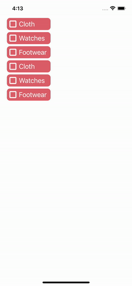

# react-native-tree-selection

# [](https://www.npmjs.org/package/react-native-tree-selections) [](https://www.android.com) [](https://developer.apple.com/ios) [](https://opensource.org/licenses/MIT)

---

Introducing the Hierarchical Tree Select Control, a high-performance and lightweight library designed to effortlessly render select components with hierarchical tree data. This versatile control not only facilitates the display of work selection but also empowers users to make their own selections.

It is simple to use and fully customizable. It works on both android and iOS platforms.

---

## 🎬 Preview

---

| Tree Selection with No Children                                        | Tree Selection with children                                 |
| ---------------------------------------------------------------------- | ------------------------------------------------------------ |
|  |  |

---

## Usage and Example

[Installation](#installation) | [Tree-selection](#tree-selection) | [Properties](#properties) | [Example code](#example) | [License](#license)

# Installation

##### 1. Install library

```bash
npm install react-native-tree-selection
```

###### --- or ---

```bash
yarn add react-native-tree-selection
```

##### 2. Install cocoapods in the ios project

```bash
cd ios && pod install
```

# Tree-selection

### Tree Data Format

```jsx
const treeData: TreeDataTypes[] = [
  {
    id: '1',
    title: 'Fruits',
    data: [
      {
        title: 'Apples',
        data: [
          {
            title: 'Red Delicious',
          },
          {
            title: 'Granny Smith',
          },
          {
            title: 'Gala',
          },
        ],
      },
      {
        title: 'Bananas',
        data: [
          {
            title: 'Cavendish',
          },
          {
            title: 'Lady Finger',
          },
        ],
      },
    ],
  },
];
```

#### Basic Usage

```jsx
<TreeSelect
  data={treeData}
  childKey="data"
  titleKey="title"
  onParentPress={onParentPress}
  onChildPress={onChildPress}
  onCheckBoxPress={onCheckBoxPress}
/>
```

Checkout TreeSelect Example [here](./example/src/App.tsx)

##### App

```jsx
import React from 'react';
import {
  TreeDataTypes,
  TreeSelect,
} from 'react-native-tree-selection';

const App = () => {

  return (
    <TreeSelect
      data={treeData}
      childKey="data"
      textKey="title"
      onParentPress={onParentPress}
      onChildPress={onChildPress}
      onCheckBoxPress={onCheckBoxPress}
    />
    />
  );
};

export default App;
```

# Properties

---

| Prop                  | Default | Type                      | Description                                                                                                               |
| :-------------------- | :------ | :------------------------ | :------------------------------------------------------------------------------------------------------------------------ |
| data                  | -       | [Data](#tree-data-format) | An array of objects representing multiple data items in a tree, to which you can add any data, will be accepted for data. |
| childKey              | data    | string                    | Specifies the name of the property in each node object that contains the children to display.                             |
| titleKey              | title   | string                    | Specifies the name of the property in each node object that contains the title to display.                                |
| onParentPress         | -       | function                  | A callback function that is called when a parent node is clicked.                                                         |
| onChildPress          | -       | function                  | A callback function that is called when a child node is clicked.                                                          |
| onCheckBoxPress       | -       | function                  | A callback function that is called when a checkbox is clicked.                                                            |
| rightIconStyles       | -       | ImageStyle                | Checkbox image style                                                                                                      |
| leftIconStyles        | -       | ImageStyle                | Arrow image style                                                                                                         |
| parentContainerStyles | -       | ViewStyle                 | Style for Parent Container                                                                                                |
| childContainerStyles  | -       | TextStyle                 | Style for Child Container                                                                                                 |
| parentTextStyles      | -       | TextStyle                 | Text Styles for Parent                                                                                                    |
| childTextStyles       | -       | TextStyle                 | Text Styles for Child                                                                                                     |
| containerStyles       | -       | ViewStyle                 | To change style of root view.                                                                                             |
| autoSelectParents     | true    | Boolean                   | Parents will gets selected when all the children are selected.                                                            |
| autoSelectChildren    | true    | Boolean                   | Children will gets selected when parent is selected.                                                                      |
| renderArrowOpen       | -       | ImagePropType             | Change icon for Arrow when parent expands.                                                                                |
| renderArrowClosed     | -       | ImagePropType             | Change icon for checkbox when checkbox is selected.                                                                       |
| renderSelect          | -       | ImagePropType             | Change icon for checkbox when checkbox is selected.                                                                       |
| renderUnSelect        | -       | ImagePropType             | Change icon for checkbox when checkbox is unselected.                                                                     |

---

# Example

A full working example project is here [Example](./example/src/App.tsx)

```sh
yarn
yarn example ios   // For ios
yarn example android   // For Android
```

# TODO

- [ ] Provide dynamic render items

## Find this library useful? ❤️

Support it by joining [stargazers](https://github.com/SimformSolutionsPvtLtd/react-native-tree-selection/stargazers) for this repository.⭐

## Bugs / Feature requests / Feedbacks

For bugs, feature requests, and discussion please use [GitHub Issues](https://github.com/SimformSolutionsPvtLtd/react-native-tree-selection/issues/new?labels=bug&late=BUG_REPORT.md&title=%5BBUG%5D%3A), [GitHub New Feature](https://github.com/SimformSolutionsPvtLtd/react-native-tree-selection/issues/new?labels=enhancement&late=FEATURE_REQUEST.md&title=%5BFEATURE%5D%3A), [GitHub Feedback](https://github.com/SimformSolutionsPvtLtd/react-native-tree-selection/issues/new?labels=enhancement&late=FEATURE_REQUEST.md&title=%5BFEEDBACK%5D%3A)

## 🤝 How to Contribute

We'd love to have you improve this library or fix a problem 💪
Check out our [Contributing Guide](CONTRIBUTING.md) for ideas on contributing.

## Awesome Mobile Libraries

- Check out our other [available awesome mobile libraries](https://github.com/SimformSolutionsPvtLtd/Awesome-Mobile-Libraries)

## License

- [MIT License](./LICENSE)
